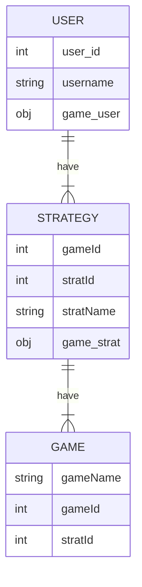

# Data Model

## Data Diagram



>The above model is the abstraction of the data model further explored below.

## Mock .bson documents
Below are two mock .bson documents to provide further understanding of the data model of our MVC using a domain specific example.

```json
{
  "_id": 1,
  "username": "username1",
  "game": [
    {
      "strat_id": "strat123",
      "metric": 2, // number of times player reached a solution with given strategy
      "GamesPlayed": [
        {
          "gameId": 122, // specific game instance
          "gameName": "asdf122"
        },
        {
          "gameId": 123,
          "gameName": "asdf123"
        }
      ]
    },
    {
      "strat_id": "strat124",
      "metric": 1,
      "GamesPlayed": [
        {
          "gameId": 124,
          "gameName": "asdf124"
        }
      ]
    },
    {
      "strat_id": "strat125",
      "metric": 1,
      "GamesPlayed": [
        {
          "gameName": "asdf125",
          "gameId": 125
        }
      ]
    }
  ]
}
```
>Shown as .json for the sake of demonstration only

For the strategies, the chosen model is the document type including an array of strings for the game piece queue as well as embedded documents for game board setups.

```json
{
  "strat": {
    "stratName": "a bad strategy",
    "metric": 1, // the number of times any user has completed a game using this strat
    "game": {
      "gameName": "level 1",
      "pieceQueue": ["", "", "", "", "", "", "", "", "", ""],
      "initialState": [
        ["", "", "", "", "", "", "", "", "", ""],
        ["", "", "", "", "", "", "", "", "", ""],
        ["", "", "", "", "", "", "", "", "", ""],
        ["", "", "", "", "", "", "", "", "", ""],
        ["", "", "", "", "", "", "", "", "", ""],
        ["", "", "", "", "", "", "", "", "", ""],
        ["", "", "", "", "", "", "", "", "", ""],
        ["", "", "", "", "", "", "", "", "", ""],
        ["", "", "", "", "", "", "", "", "", ""],
        ["", "", "", "", "", "", "", "", "", ""],
        ["", "", "", "", "", "", "", "", "", ""],
        ["", "", "", "", "", "", "", "", "", ""],
        ["", "", "", "", "", "", "", "", "", ""],
        ["", "", "", "", "", "", "", "", "", ""],
        ["", "", "", "", "", "", "", "", "", ""],
        ["", "", "", "", "", "", "", "", "", ""],
        ["", "", "", "", "", "", "", "", "", ""],
        ["", "", "", "", "", "", "", "", "", ""],
        ["", "", "", "", "", "", "", "", "", ""],
        ["", "", "", "", "", "", "", "", "", ""]
      ]
    },
    "solution": {
      "stepsToSolve": 20,
      "finalState": [
        ["", "", "", "", "", "", "", "", "", ""],
        ["", "", "", "", "", "", "", "", "", ""],
        ["", "", "", "", "", "", "", "", "", ""],
        ["", "", "", "", "", "", "", "", "", ""],
        ["", "", "", "", "", "", "", "", "", ""],
        ["", "", "", "", "", "", "", "", "", ""],
        ["", "", "", "", "", "", "", "", "", ""],
        ["", "", "", "", "", "", "", "", "", ""],
        ["", "", "", "", "", "", "", "", "", ""],
        ["", "", "", "", "", "", "", "", "", ""],
        ["", "", "", "", "", "", "", "", "", ""],
        ["", "", "", "", "", "", "", "", "", ""],
        ["", "", "", "", "", "", "", "", "", ""],
        ["", "", "", "", "", "", "", "", "", ""],
        ["", "", "", "", "", "", "", "", "", ""],
        ["", "", "", "", "", "", "", "", "", ""],
        ["", "", "", "", "", "", "", "", "", ""],
        ["", "", "", "", "", "", "", "", "", ""],
        ["", "", "", "", "", "", "", "", "", ""],
        ["", "", "", "", "", "", "", "", "", ""]
      ]
    },
    // for MVP2 only, full text description of the strategy which will be captured in the wiki
    "strategyText": "This is the information a contributor would have entered with strategic information."
  }
}
```
>Shown as .json for the sake of demonstration only