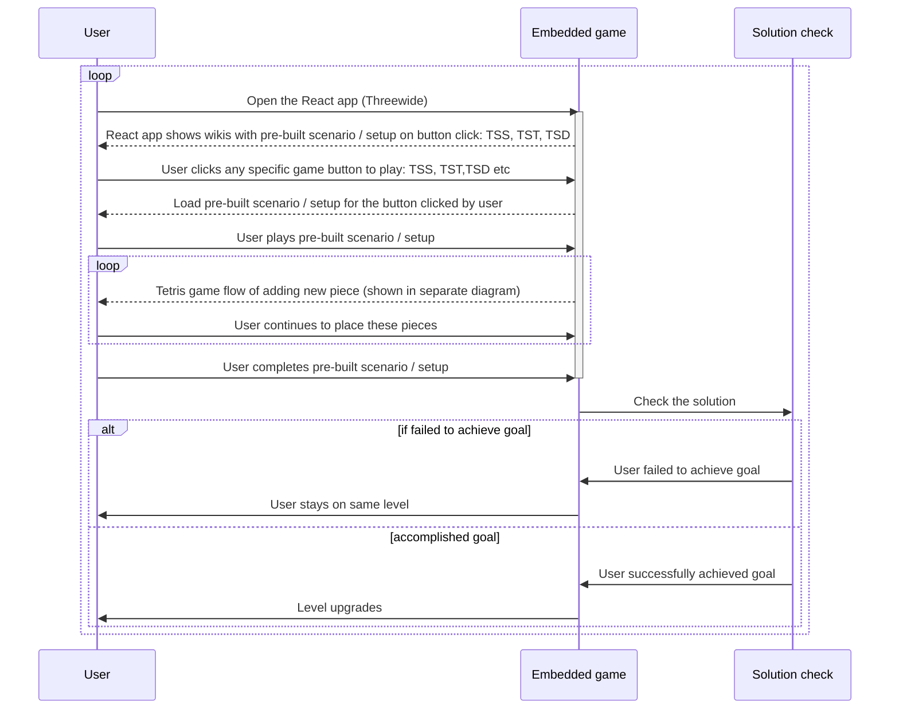

# 

```mermaid
sequenceDiagram
    participant User
    participant Embedded game
    participant Solution check

    loop 
        User->>Embedded game : Open the React app (Threewide)
        activate Embedded game

        Embedded game-->> User : React app shows wikis with pre-built scenario / setup on button click: TSS, TST, TSD
        User->>Embedded game : User clicks any specific game button to play: TSS, TST,TSD etc
        Embedded game -->> User : Load pre-built scenario / setup for the button clicked by user
        User ->> Embedded game : User plays pre-built scenario / setup

        loop
        Embedded game -->> User : Tetris game flow of adding new piece (shown in separate diagram)
        User ->> Embedded game : User continues to place these pieces
        end
        
        User->>Embedded game : User completes pre-built scenario / setup
        deactivate Embedded game

        Embedded game ->> Solution check : Check the solution

        alt  if failed to achieve goal
            Solution check ->> Embedded game : User failed to achieve goal
            Embedded game ->> User : User stays on same level
        else   accomplished goal
            Solution check->> Embedded game : User successfully achieved goal
            Embedded game ->> User: Level upgrades
        end
    end 
```