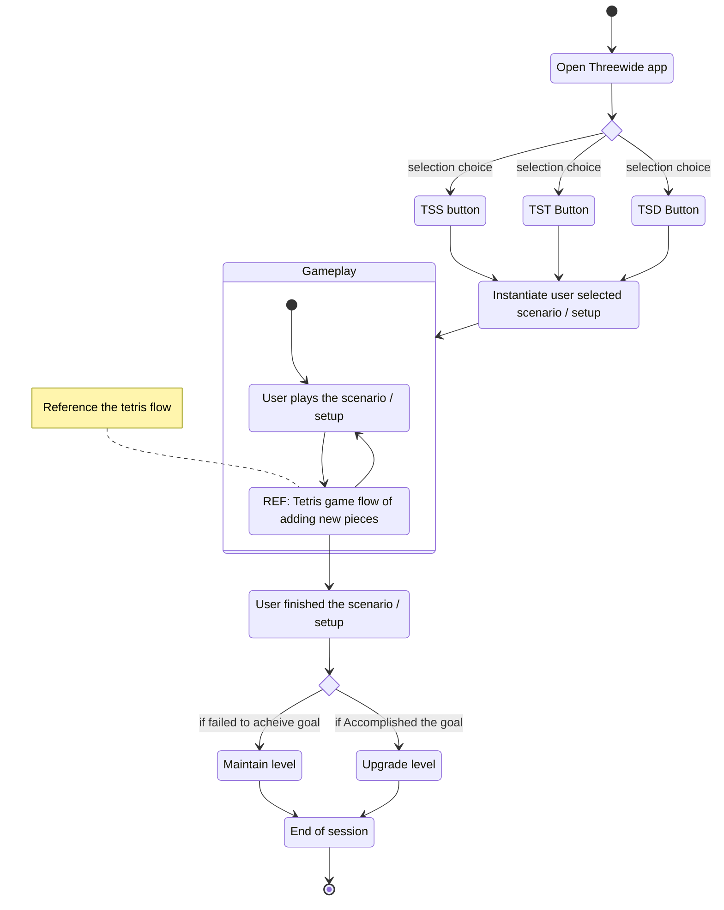

# State Diagram

[Tetris Flow](/Diagrams/Tetris%20flow.md) Diagram for reference within composite state of Gameplay. 

---

```mermaid
    stateDiagram-v2

            state "Open Threewide app" as s1
            %% state "Strategy learning wiki" as s2
            state "TSS button" as s3
            state "TST Button" as s4
            state "TSD Button" as s5
            state "Instantiate user selected scenario / setup" as s6
            state "User plays the scenario / setup" as s7
            state "REF: Tetris game flow of adding new pieces "as s8
            state "User finished the scenario / setup" as s9
            state "Maintain level" as s10
            state "Upgrade level" as s11
            state "End of session" as s12
            note left of s8
                Reference the tetris flow
                end note
        [*] --> s1

        
        state if_state_for_button <<choice>>
        s1-->if_state_for_button
        if_state_for_button-->s3 : selection choice
        if_state_for_button-->s4 : selection choice
        if_state_for_button-->s5 : selection choice

        s3-->s6
        s4-->s6
        s5-->s6

        s6 --> Gameplay
            state Gameplay {
                [*] --> s7
                s7 --> s8
                s8 --> s7
            }
        %% s6-->s7
        %% s8-->s7
        %% s7-->s8
        s8-->s9

        state if_state <<choice>>
        s9-->if_state
        if_state -->s10 : if failed to acheive goal
        if_state -->s11 : if Accomplished the goal
        s10-->s12
        s11-->s12
        s12-->[*]
```