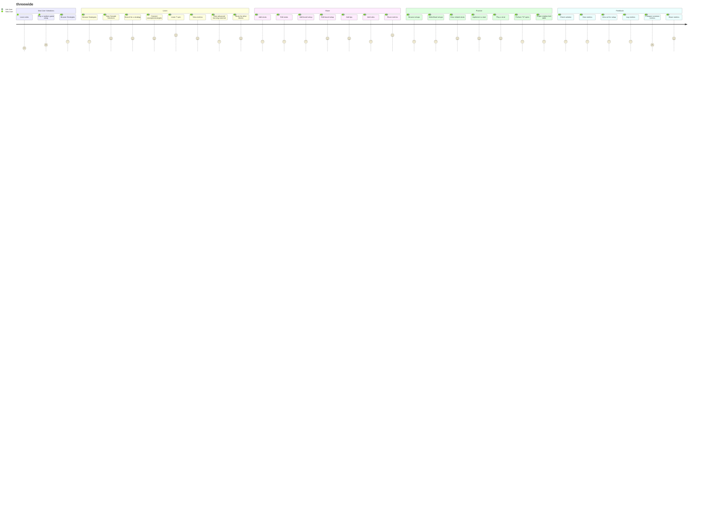

# User Journey Diagram

```mermaid
  journey
    title threewide  
    section New User Interations  
      Learn rules: 1: New User  
      Play a random game setup: 2: New User  
      Browse Strategies: 3: New User, Adv User 
    section Learn
      Browse Strategies: 3: New User, Adv User 
      View Sample Solutions: 4: New User, Adv User 
      Search for a strategy: 4: New User, Adv User 
      Connect concepts/strategies: 4: New User, Adv User 
      Learn T spin: 5: New User, Adv User 
      View metrics: 4: New User, Adv User 
      View advanced learning material: 3: New User, Adv User 
      Strats for other blocks: 4: New User, Adv User 
    section Share
      Add strats: 3: New User, Adv User 
      Edit strats: 3: New User, Adv User 
      Add board setup: 3: New User, Adv User 
      Edit board setup: 4: New User, Adv User 
      Add tips: 4: New User, Adv User 
      Add rules: 3: New User, Adv User 
      Share metrics: 5: New User, Adv User 
    section Practice
      Browse setups: 3: New User, Adv User 
      Select/load setups: 3: New User, Adv User 
      View related strats: 4: New User, Adv User 
      Implement a strat: 4: New User, Adv User 
      Play a strat: 4: New User, Adv User 
      Perform *N* spins: 3: New User, Adv User 
      Super rotation kick table: 3: New User, Adv User 
    section Feedback
      Check solution: 3: New User, Adv User 
      View metrics: 3: New User, Adv User 
      View sol for setup: 3: New User, Adv User 
      Log metrics: 3: New User, Adv User 
      Compare common metrics: 2: New User, Adv User 
      Share metrics: 4: New User, Adv User 
```