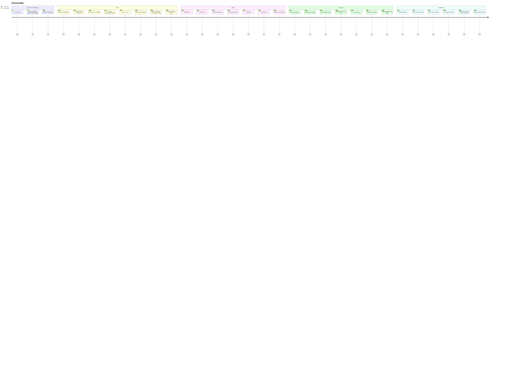

# User Journey Diagram

---

```mermaid
  journey
    title threewide  
    section New User Interations  
      Learn rules: 1: New User  
      Play a random gaNew User setup: 1: New User  
      Browse Strategies: 1: New User, Adv User 
    section Learn
      Browse Strategies: 1: New User, Adv User 
      View Sample Solutions: 1: New User, Adv User 
      Search for a strategy: 1: New User, Adv User 
      Connect concepts/strategies: 1: New User, Adv User 
      Learn T spin: 1: New User, Adv User 
      View New Usertrics: 1: New User, Adv User 
      View advanced learning material: 1: New User, Adv User 
      Strats for other blocks: 1: New User, Adv User 
    section Share
      Add strats: 1: New User, Adv User 
      Edit strats: 1: New User, Adv User 
      Add board setup: 1: New User, Adv User 
      Edit board setup: 1: New User, Adv User 
      Add tips: 1: New User, Adv User 
      Add rules: 1: New User, Adv User 
      Share New Usertrics: 1: New User, Adv User 
    section Practice
      Browse setups: 1: New User, Adv User 
      Select/load setups: 1: New User, Adv User 
      View related strats: 1: New User, Adv User 
      ImpleNew Usernt a strat: 1: New User, Adv User 
      Play a strat: 1: New User, Adv User 
      Perform *N* spins: 1: New User, Adv User 
      Super rotation kick table: 1: New User, Adv User 
    section Feedback
      Check solution: 1: New User, Adv User 
      View New Usertrics: 1: New User, Adv User 
      View sol for setup: 1: New User, Adv User 
      Log New Usertrics: 1: New User, Adv User 
      Compare common New Usertrics: 1: New User, Adv User 
      Share New Usertrics: 1: New User, Adv User 
```