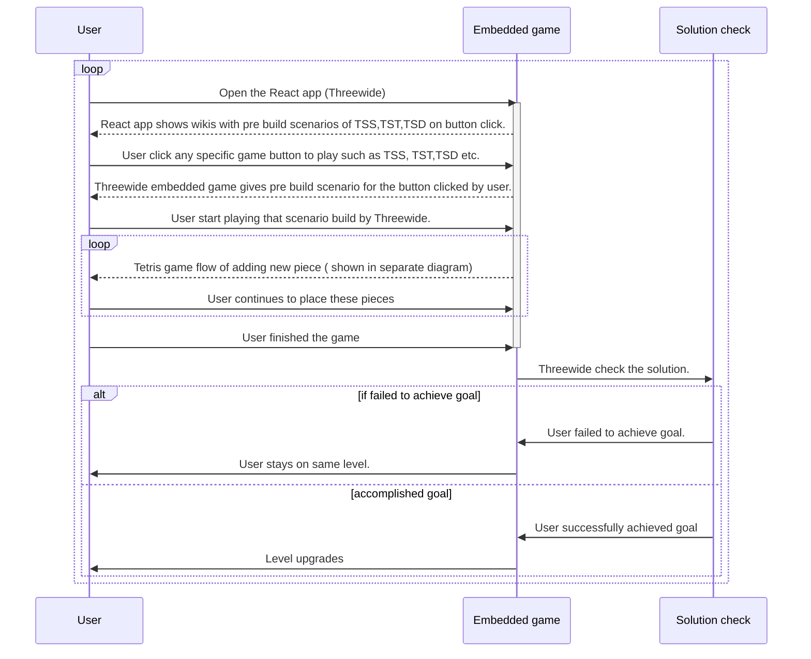

```mermaid
sequenceDiagram
    participant User
    participant Embedded game
    participant Solution check

    loop 
        User->>Embedded game : Open the React app (Threewide)
        activate Embedded game

        Embedded game-->> User : React app shows wikis with pre build scenarios of TSS,TST,TSD on button click.
        User->>Embedded game : User click any specific game button to play such as TSS, TST,TSD etc.
        Embedded game -->> User : Threewide embedded game gives pre build scenario for the button clicked by user.
        User ->> Embedded game : User start playing that scenario build by Threewide.

        loop
        Embedded game -->> User : Tetris game flow of adding new piece ( shown in separate diagram)
        User ->> Embedded game : User continues to place these pieces
        end
        
        User->>Embedded game : User finished the game
        deactivate Embedded game

        Embedded game ->> Solution check : Threewide check the solution.

        alt  if failed to achieve goal
            Solution check ->> Embedded game : User failed to achieve goal.
            Embedded game ->> User : User stays on same level.
        else   accomplished goal
            Solution check->> Embedded game : User successfully achieved goal
            Embedded game ->> User: Level upgrades
        end
    end 
```