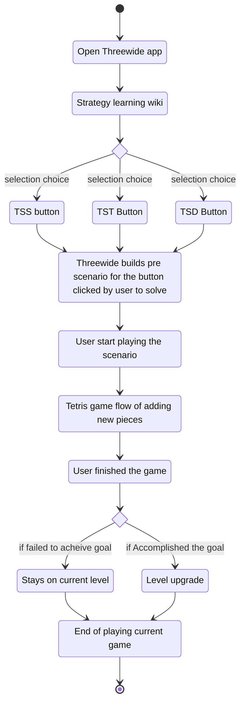

```mermaid
    stateDiagram
        
            state "Open Threewide app" as s1
            state "Strategy learning wiki" as s2
            state "TSS button" as s3
            state "TST Button" as s4
            state "TSD Button" as s5
            state "Threewide builds pre scenario for the button clicked by user to solve" as s6
            state "User start playing the scenario" as s7
            state "Tetris game flow of adding new pieces "as s8
            state "User finished the game" as s9
            state "Stays on current level" as s10
            state "Level upgrade" as s11
            state "End of playing current game " as s12

        [*] --> s1
        s1 --> s2
        
        state if_state_for_button <<choice>>
        s2-->if_state_for_button
        if_state_for_button-->s3 : selection choice
        if_state_for_button-->s4 : selection choice
        if_state_for_button-->s5 : selection choice

        s3-->s6
        s4-->s6
        s5-->s6

        s6-->s7
        s7-->s8
        s8-->s9

        state if_state <<choice>>
        s9-->if_state
        if_state -->s10 : if failed to acheive goal
        if_state -->s11 : if Accomplished the goal
        s10-->s12
        s11-->s12
        s12-->[*]


```